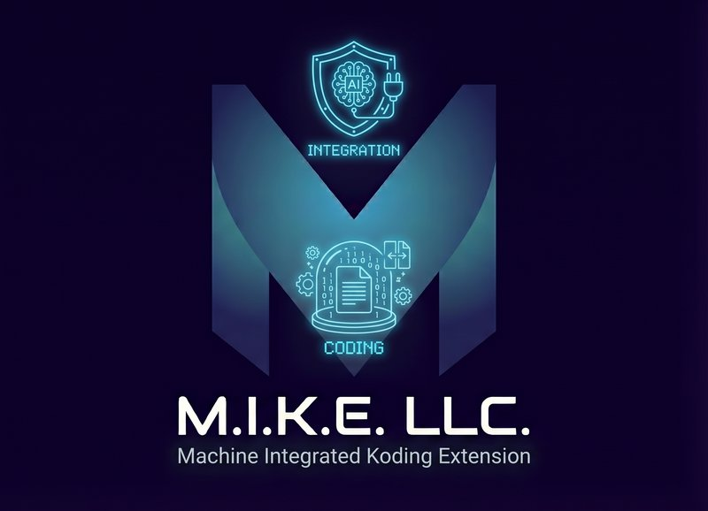

<p align="center">
  
</p>

# M.I.K.E. — Machine-Integrated Koding Extension

<p align="left">
  
  
  
  
  
</p>

**M.I.K.E.** (**Machine-Integrated Koding Extension**) is a high-performance, autonomous AI software engineering extension for Visual Studio Code. Built natively with the VS Code Extensibility API and modern Web Standards (ES2022 / Node 18+ global `fetch`), M.I.K.E. works seamlessly with **any OpenAI-compatible LLM endpoint** — including local open-weight inference servers (Ollama, LM Studio, vLLM, LocalAI), cloud APIs (OpenAI, Groq, LiteLLM), and enterprise private inference clusters.

---

## ⚡ 60-Second Quickstart & Initialization

### 1. Install Extension
Install from the Open VSX Registry, VS Code Marketplace, or via `.vsix`:
```bash
code --install-extension mike-koding-extension-1.5.0.vsix --force
```

### 2. Connect to Your LLM Backend
Click the **M.I.K.E. sparkle icon** in the VS Code Activity Bar (left), open **`⚙️ Config`**, and choose your provider:

| Backend | Base URL | API Key | Model Example |
| :--- | :--- | :--- | :--- |
| **Ollama (Local)** | `http://localhost:11434/v1` | *(Leave blank)* | `qwen2.5-coder:32b`, `deepseek-coder-v2` |
| **LM Studio (Local)** | `http://localhost:1234/v1` | *(Leave blank)* | `qwen2.5-coder-7b-instruct` |
| **vLLM (Local / Server)** | `http://localhost:8000/v1` | *(Optional token)* | `Qwen/Qwen2.5-Coder-32B-Instruct` |
| **OpenAI (Cloud)** | `https://api.openai.com/v1` | `sk-...` | `gpt-4o`, `gpt-4o-mini` |
| **LiteLLM / Custom Proxy** | `http://localhost:4000/v1` | `sk-...` | Any routed model |

### 3. Test & Auto-Discover Models
Click **`Test`** or **`🔄 Auto-Discover`** in the config panel. M.I.K.E. will automatically probe `/models`, discover all active models on your server, verify connectivity, and save confirmed credentials globally.

### 4. Start Coding!
- **Sidebar Chat:** Ask questions, request file changes, attach `@editor` or `@selection` context chips.
- **In-Editor Inline Transform:** Highlight code and press <kbd>Cmd+I</kbd> (macOS) or <kbd>Ctrl+I</kbd> (Windows/Linux).
- **Skill Invocation:** Type `/` in the prompt box to autocomplete discovered workspace and global automation skills.

---

## 🌟 Core Superpowers & Features

### ⚡ 1. In-Editor Inline Transform (<kbd>Cmd + I</kbd> / <kbd>Ctrl + I</kbd>)
Refactor and transform code directly in the active editor without context-switching to the sidebar:
- Instant HUD with quick recipes: *Optimize Performance*, *Add Error Handling*, *Add TypeScript Types & JSDoc*, *Convert to Async/Await*, *Generate Unit Tests*, or *Custom Instruction*.
- Streamed in-memory edits directly into the editor buffer with native <kbd>Cmd+Z</kbd> undo support.
- One-click **`✓ Keep`**, **`⏪ Revert`**, or **`✨ Fix Diagnostics`**.

### ⏪ 2. Atomic Pre-Write Checkpoints & "Reject All" Rollback
- **Safety Net:** Before any AI operation writes to disk, M.I.K.E. captures the exact pre-modification binary state.
- **Side-by-Side Diff View:** Automatically launches VS Code's native side-by-side diff (`mike-diff://...`) for visual verification.
- **Session Changes Bar:** Tracks the total number of modified and created files with single-click **`⏪ Reject All`** rollback.

### 💬 3. Multi-Thread Persistent History
- **Multi-Thread Session Drawer:** Click **`💬 History`** to browse, switch, or clean past conversations.
- **Auto-Derived Titles:** Threads automatically name themselves based on the user's initial prompt.
- **Workspace State Persistence:** Sessions survive VS Code restarts and window reloads.

### 🩺 4. Language Server Diagnostics & Compiler Self-Healing
- **Live Compiler Feedback:** Hooks into active VS Code Language Servers (TypeScript, Python Pylance, C# Roslyn, Go, Rust).
- **Autonomous Error Correction:** Detects compiler syntax and type errors immediately after writing code and automatically self-heals in the next turn.
- **Editor Quick-Fix Lightbulb:** Click the lightbulb on any squiggly error line $\rightarrow$ **`✨ Ask M.I.K.E. to fix: <error>`**.

### 🔎 5. Fast Workspace Grep & AST Symbol Search
- **`grep_search` Tool:** Fast, zero-dependency VFS text searching with regex, case-insensitivity, and glob filtering.
- **`find_symbol` Tool:** Queries VS Code's native symbol index for classes, functions, and interfaces in milliseconds.

### ⚡ 6. Extensible Skill System (`/<skill-name>`)
- Automatically discovers and parses `SKILL.md` workflows from `.agent/skills/`, `.skills/`, `skills/`, and global `~/.gemini/config/skills/` or `~/.config/mike/skills/`.
- Type `/` in the prompt input to filter and auto-complete skills with full YAML metadata.

---

## 🛡️ Zero-Shell Security Architecture

Traditional AI coding plugins often execute subprocess shellouts (`echo`, `cat`, `Set-Content`, `powershell.exe`, `bash`, `git`) to mutate code on disk. In corporate, Windows, or air-gapped workstations, this creates severe failure modes:
- Process spawn blocks by enterprise endpoint security / AppLocker.
- PowerShell pipeline character encoding corruptions (CRLF, BOM, UTF-16 bugs).
- Headless terminal buffer hangs and process deadlocks.

### The M.I.K.E. Guarantee:
1. **Pure Virtual File System (VFS):** All workspace inspections and mutations are executed strictly via `vscode.workspace.fs` (`writeFile`, `readFile`, `readDirectory`). Zero shell calls are used for file I/O.
2. **Native Host Networking:** Built on Node 18+ global `fetch` to inherit OS root certificates, corporate proxies, and custom trust stores without third-party npm packages.
3. **Encrypted Secret Storage:** API keys are stored in the operating system's Credential Keychain via `vscode.SecretStorage`.
4. **Zero Runtime Dependencies:** Ultra-lightweight bundle size (< 50 KB).

---

## ⚙️ Configuration Reference

Configure under **Settings** (`Ctrl+,` or `Cmd+,` $\rightarrow$ Search `M.I.K.E.`) or via `.vscode/settings.json`:

| Setting | Type | Default | Description |
| :--- | :--- | :--- | :--- |
| `mike.baseUrl` | `string` | `http://localhost:11434/v1` | Base URL for OpenAI-compatible inference server. |
| `mike.apiKey` | `string` | `""` | API Key / Bearer token (stored securely in OS Keychain). |
| `mike.model` | `string` | `qwen2.5-coder` | Model ID for completions and tool use. |
| `mike.temperature` | `number` | `0.0` | Sampling temperature (`0.0` for deterministic, typo-free code). |
| `mike.maxTokens` | `number` | `8192` | Maximum output token limit per turn. |
| `mike.commandMode` | `string` | `"prompt"` | Shell execution policy (`"prompt"`, `"auto"`, `"deny"`). |
| `mike.customSkillPaths` | `string[]` | `[]` | Additional directories to scan for `SKILL.md` files. |

---

## 🛠 Available Agent Tools

| Tool | Parameters | Description |
| :--- | :--- | :--- |
| `write_file` | `path: string`, `content: string` | Writes UTF-8 content via `vscode.workspace.fs`. Triggers in-memory diff and checkpoint. |
| `read_file` | `path: string` | Reads and returns full UTF-8 file content via `vscode.workspace.fs`. |
| `list_dir` | `path?: string` | Lists directory entries (files, directories, symlinks) recursively. |
| `grep_search` | `query: string`, `isRegex?: boolean`, `caseInsensitive?: boolean`, `filePattern?: string` | Searches workspace files for matching patterns and returns line snippets. |
| `find_symbol` | `query: string` | Queries VS Code's symbol index for classes, methods, and functions. |
| `get_diagnostics` | `path?: string` | Returns active Language Server errors and warnings across the workspace. |
| `run_command` | `command: string` | Executes terminal commands according to user security policy. |

---

## 📚 In-Depth Documentation

- [📖 User & Operator Guide](docs/USER_GUIDE.md) — Comprehensive guide for daily workflows and shortcuts.
- [🧭 Initialization & Lifecycle Guide](docs/INITIALIZATION_GUIDE.md) — Deep-dive into M.I.K.E.'s 6-phase initialization lifecycle.
- [📦 Extension Publishing Guide](docs/PUBLISHING_GUIDE.md) — Guide for publishing to Open VSX and VS Code Marketplace.
- [🏛 Architectural Specifications](docs/README.md) — Detailed internal architecture and component design.
- [📋 Functional Requirements Spec](docs/REQUIREMENTS.md) — Complete requirements specification.

---

## 🚀 Building & Contributing

```bash
# Clone repository
git clone https://github.com/<your-org>/mike-koding-extension.git
cd mike-koding-extension

# Install dependencies
npm install

# Compile TypeScript
npm run compile

# Run automated test suite
npm test

# Build VSIX package
npm run package

# Run local mock SSE LLM server for testing
npm run mock-server
```

---

## 📄 License

MIT License. Copyright (c) 2026 M.I.K.E. Systems. See [LICENSE](LICENSE) for details.
