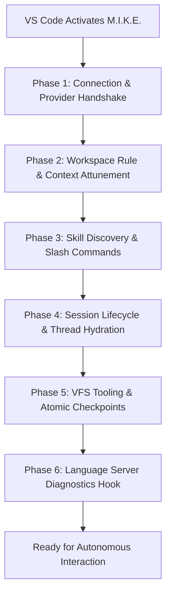

# M.I.K.E. — Deep-Dive Initialization & Lifecycle Guide

This guide details the exact lifecycle and **Initialization Phase** of **M.I.K.E. (Machine-Integrated Koding Extension)** in Visual Studio Code. Understanding how M.I.K.E. initializes its connection, reads workspace context, registers tools, and manages atomic checkpoints ensures smooth onboarding across any local or enterprise environment.

---

## 🧭 Initialization Architecture Overview

When VS Code loads M.I.K.E., the extension completes a 6-phase initialization pipeline:



---

## ⚡ Phase 1: Connection & Provider Handshake

### 1. Endpoint Resolution
M.I.K.E. connects to any OpenAI-compatible HTTP inference backend. When resolving the target endpoint, M.I.K.E. evaluates configuration using a strict priority ladder:

1. **`globalState`:** User-selected URL persisted across sessions and workspaces in VS Code's global storage.
2. **VS Code Settings (`settings.json`):** `mike.baseUrl`.
3. **Environment Variables:** `MIKE_BASE_URL` $\rightarrow$ `OPENAI_BASE_URL` $\rightarrow$ `POOLSIDE_BASE_URL`.
4. **Default Fallback:** `http://localhost:11434/v1` (Standard local Ollama / vLLM / LM Studio port).

### 2. URL Normalization
M.I.K.E.'s `resolveEndpoint()` intelligently normalizes arbitrary user inputs:
- Bare hosts like `localhost:11434` or `api.openai.com` $\rightarrow$ `http://localhost:11434/v1/chat/completions` or `https://api.openai.com/v1/chat/completions`.
- Subpaths like `/v1`, `/openai/v1`, `/api/v1` $\rightarrow$ Appends `/chat/completions` automatically.
- Direct endpoint URLs $\rightarrow$ Preserved as-is.

### 3. Secure Credential Storage
- API keys and tokens are stored in the operating system's native Credential Keychain (macOS Keychain, Windows Credential Manager, Linux Secret Service via `vscode.SecretStorage`).
- If no key is set in `SecretStorage`, M.I.K.E. checks `MIKE_API_KEY`, `OPENAI_API_KEY`, and `POOLSIDE_API_KEY` environment variables.
- For local inference engines (Ollama, LM Studio, vLLM), the API key is completely optional.

### 4. Zero-Dependency Probing & Model Discovery
Clicking **`🔄 Auto-Discover`** or **`Test`** triggers an automated probe:
- Requests `GET /models` or `GET /v1/models`.
- Discovers available model IDs (e.g. `qwen2.5-coder:32b`, `deepseek-coder`, `gpt-4o`).
- Tests candidate auth header formats (`Authorization: Bearer <key>`, `X-API-Key: <key>`, `api-key: <key>`, or unauthenticated).
- Persists confirmed working endpoints globally.

---

## 📜 Phase 2: Workspace Rule & Context Attunement

M.I.K.E. constructs its dynamic system prompt by scanning for project guidelines and persona rules:

1. **Global User Directives:**
   - Scans `~/.config/mike/AGENTS.md` and `~/.config/poolside/AGENTS.md`.
   - Allows users to maintain persistent coding preferences (e.g. "Always write strict TypeScript", "Use functional components") across all projects.

2. **Workspace-Specific Directives:**
   - Scans the open workspace root for:
     - `.agent/AGENTS.md`
     - `AGENTS.md`
     - `GEMINI.md`
     - `MIKE.md`
     - `CLAUDE.md`
   - Dynamically injects project architecture, coding standards, formatting guidelines, and operational boundaries into the active LLM context.

3. **Context Safety Clamping:**
   - Limits directive characters (up to 25,000 characters) to prevent context exhaustion.

---

## ⚡ Phase 3: Skill Discovery & Hierarchical Resolution

M.I.K.E. includes a native skill execution subsystem that scans for domain-specific automation routines:

### Skill Scan Paths (Priority Order)
1. **Workspace Local Skills:**
   - `<workspace>/.agent/skills/**/SKILL.md`
   - `<workspace>/.skills/**/SKILL.md`
   - `<workspace>/skills/**/SKILL.md`
2. **Global System Skills:**
   - `~/.gemini/config/skills/**/SKILL.md`
   - `~/.gemini/config/plugins/*/skills/**/SKILL.md`
   - `~/.config/mike/skills/**/SKILL.md`
   - `~/.config/poolside/skills/**/SKILL.md`
3. **Custom Configured Directories:**
   - Configured in `mike.customSkillPaths` (`settings.json`).

### Metadata Parsing & Slash Command Hydration
Each `SKILL.md` contains YAML frontmatter defining `name` and `description`:
```yaml
---
name: create-unit-tests
description: Generates comprehensive unit test suites using Vitest/Jest
---
```
- M.I.K.E. parses this metadata without executing arbitrary code.
- When the user types `/` in the prompt box, M.I.K.E. renders an interactive autocomplete popup listing all available skills.
- Selecting a skill injects its structured instructions directly into the next prompt turn.

---

## 💬 Phase 4: Session Lifecycle & Thread Hydration

M.I.K.E. provides resilient, multi-thread conversation persistence:

1. **Workspace Storage (`workspaceState`):**
   - Conversations are stored under `mike.sessionHistory.threads` in VS Code's isolated workspace database.
   - Conversations persist across editor restarts and window reloads.

2. **Auto-Derived Thread Naming:**
   - When the user sends their first prompt, M.I.K.E. derives a clean, human-readable thread title by stripping file paths, skill tokens, and noise.

3. **Multi-Thread Switching:**
   - Users can open the **`💬 History`** drawer to browse previous threads, search past interactions, spawn a `+ New Chat`, or delete old threads.

---

## 🛡️ Phase 5: VFS Tooling & Atomic Checkpoints

M.I.K.E. enforces a strict, zero-shell security boundary for file system operations.

### Pure Virtual File System (VFS)
- All file reads and writes use **`vscode.workspace.fs`** (`Uint8Array` binary buffers).
- Zero child processes (`cat`, `echo`, `Set-Content`, `powershell.exe`, `bash`).
- Immune to OS pipe hangs, terminal buffer deadlocks, and Windows CRLF/UTF-16 encoding corruption.

### Atomic Pre-Write Checkpoints (`CheckpointManager`)
1. **Pre-Write Snapshot:** Before `write_file` modifies or creates any file on disk, M.I.K.E. reads and caches the original binary bytes in memory.
2. **In-Memory Diff Provider (`mike-diff://`):**
   - M.I.K.E. mounts the prior state under a custom virtual URI scheme (`mike-diff://...`).
   - Launches VS Code's native `vscode.diff` side-by-side editor, highlighting exact additions and deletions.
3. **Session Changes HUD:**
   - The sidebar displays a live badge counting modified and created files.
   - **`⏪ Reject All`:** Reverts every modified file and deletes newly created files atomically with a single click.
   - **`↺ Revert`:** Reverts an individual file.
   - **`✓ Keep`:** Accepts changes and clears checkpoints.

---

## 🩺 Phase 6: Language Server Diagnostics Hook

M.I.K.E. integrates directly with VS Code's active Language Servers (TypeScript Server, Python Pylance, C# Roslyn, Go Language Server, Rust Analyzer):

1. **Post-Write Validation:** Immediately after writing a file, M.I.K.E. queries `vscode.languages.getDiagnostics()`.
2. **Compiler Self-Healing:**
   - If syntax or type errors are detected, M.I.K.E. receives the exact line numbers and compiler error messages.
   - Autonomous multi-turn loops immediately prompt M.I.K.E. to repair the diagnostics before returning control to the user.
3. **Quick-Fix Lightbulb:**
   - Clicking any error line in the editor provides a lightbulb action: **`✨ Ask M.I.K.E. to fix: <error>`**.

---

## 🚀 Quick Verification & Health Check

To verify your M.I.K.E. installation and initialization:

1. Open VS Code with any workspace folder.
2. Click the **M.I.K.E.** sparkle icon in the Activity Bar.
3. Click **`⚙️ Config`** and click **Test**.
   - You should see `✔ [Bearer Token / Local] HTTP 200 (SUCCESS!)` along with auto-discovered models.
4. Type `/` in the prompt input to confirm discovered skills appear in the dropdown.
5. Highlight code in an active editor and press <kbd>Cmd+I</kbd> / <kbd>Ctrl+I</kbd> to test Inline Transform HUD.
